### 1\. Antarmuka Utama & Akses

*   **login.jpg**: Halaman masuk untuk pengguna.
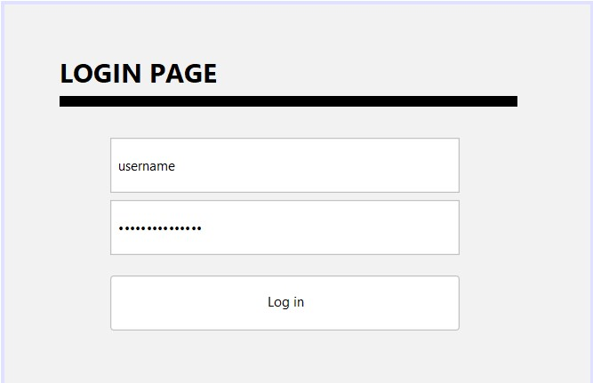
    
*   **main-menu.jpg**: Tampilan dashboard utama aplikasi.
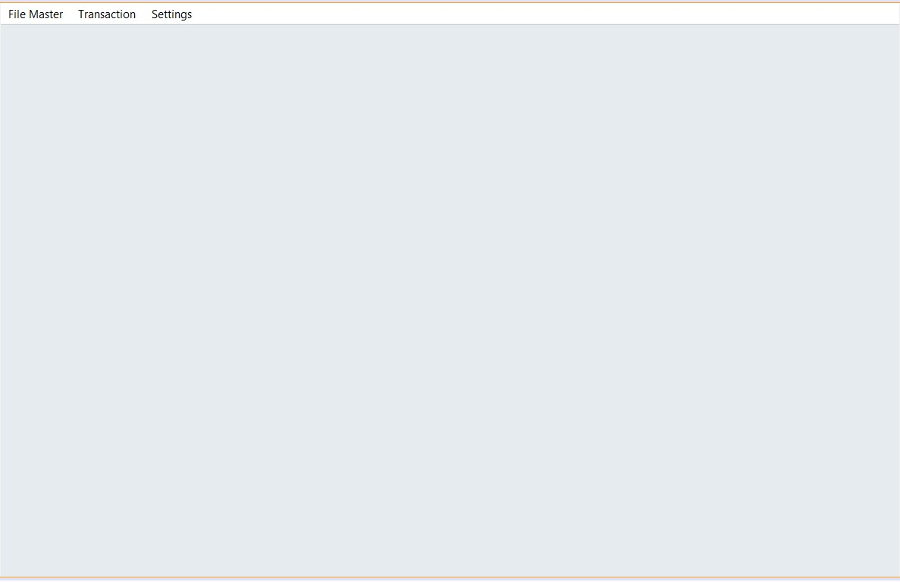
    
*   **main-menu-file-master.jpg**: Tampilan menu khusus untuk data master.
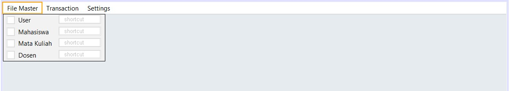
    
*   **main-menu-transcation.jpg**: Tampilan menu untuk proses transaksi.
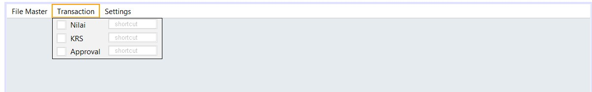
    
*   **main-menu-settings.jpg**: Tampilan menu pengaturan sistem.
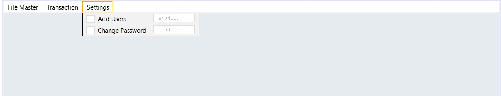
    

### 2\. Manajemen Data (Master)

*   **menu-mahasiswa.jpg**: Form pengelolaan data mahasiswa.
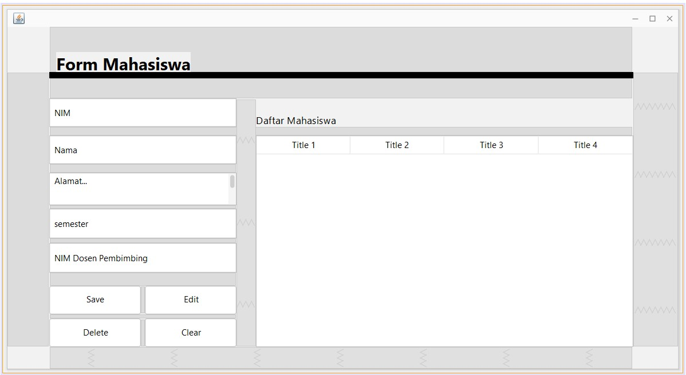
    
*   **menu-dosen.jpg**: Form pengelolaan data dosen.
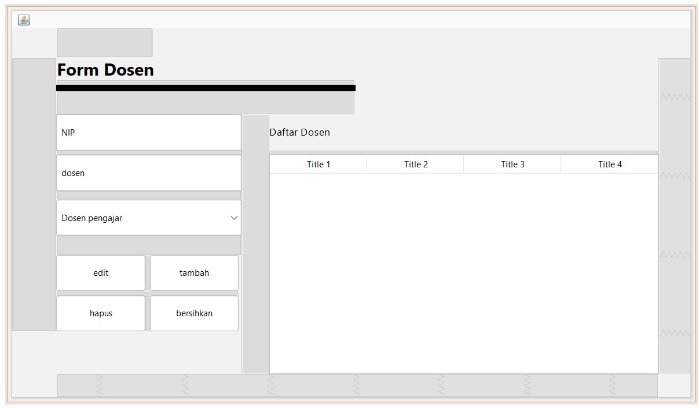
    
*   **menu-matkul.jpg**: Form pengelolaan data mata kuliah (kurikulum).
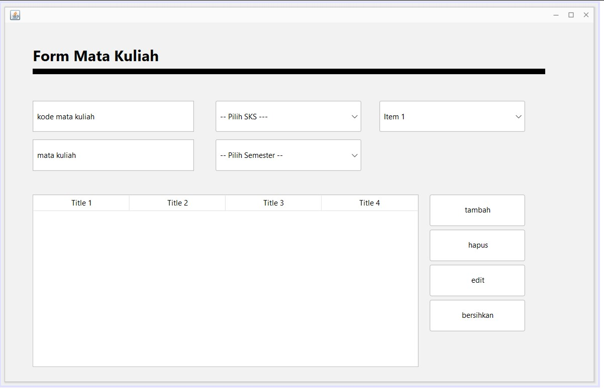

*   **menu-users.jpg**: Daftar pengguna sistem.
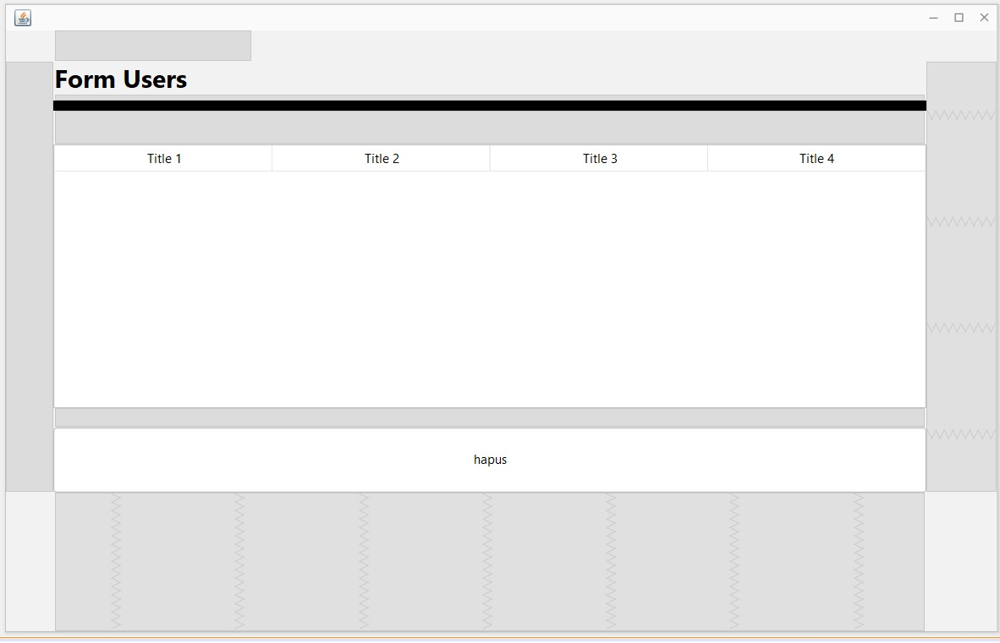
    

### 3\. Proses KRS & Akademik (Transaction)

*   **menu-krs.jpg**: Antarmuka pengisian Kartu Rencana Studi.
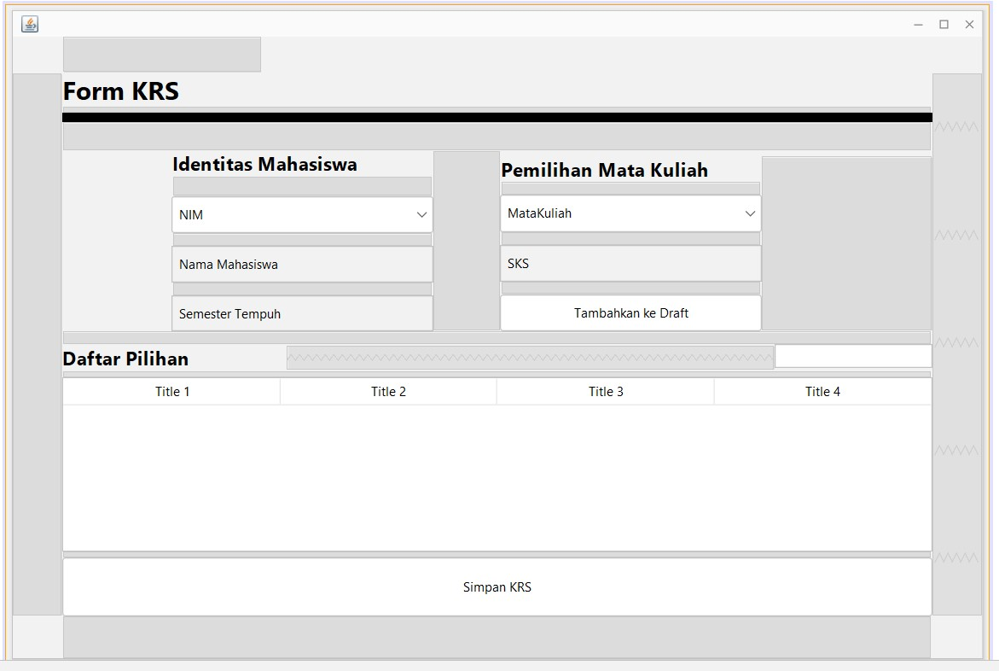
    
*   **menu-approval.jpg**: Halaman persetujuan KRS (biasanya oleh dosen wali).
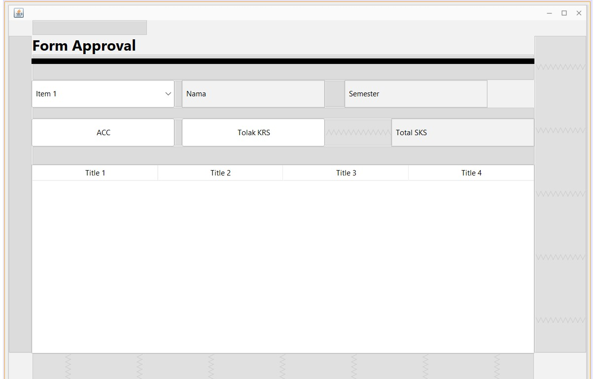
    
*   **menu-nilai.jpg**: Form input atau penampilan nilai mahasiswa.
    

### 4\. Pengaturan Pengguna

    
*   **menu-add-users.jpg**: Form untuk menambah pengguna baru.
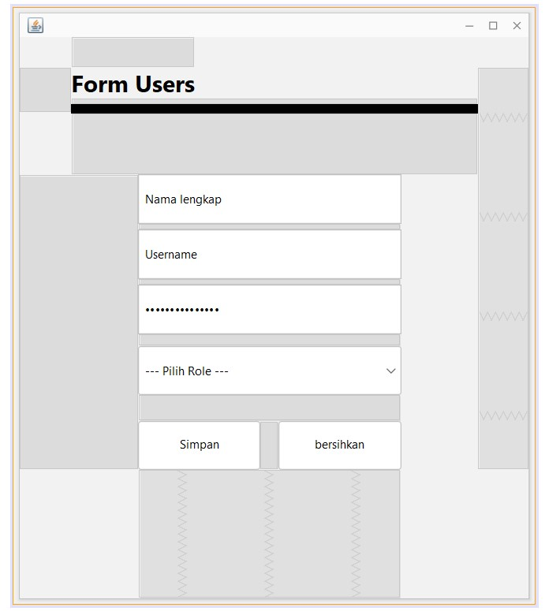
    
*   **menu-change-password.jpg**: Fitur penggantian kata sandi.
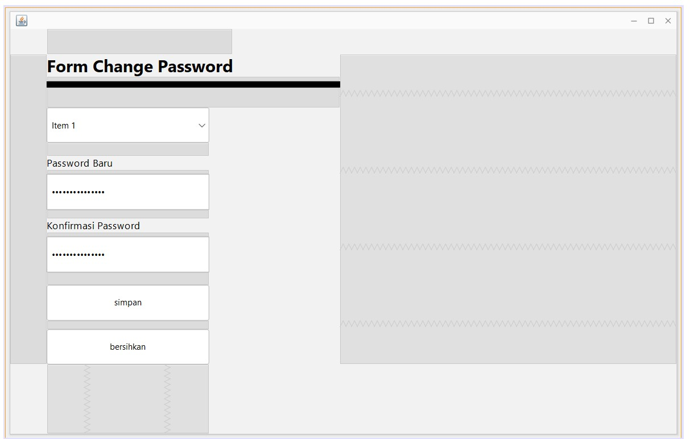

### 5\. Desain Database
*   **Desain database**: Meliputi File master dan transaction
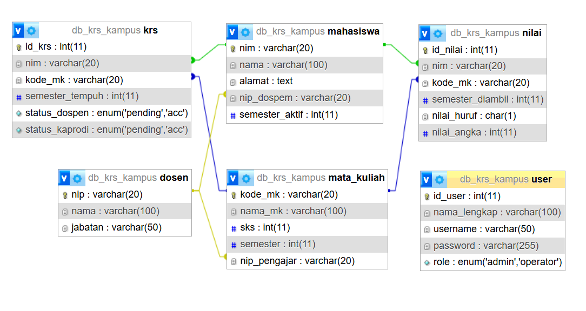
